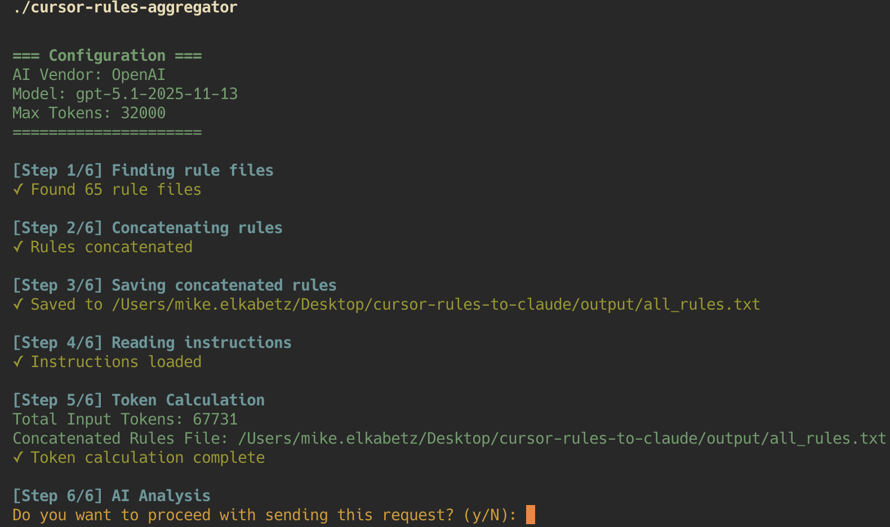
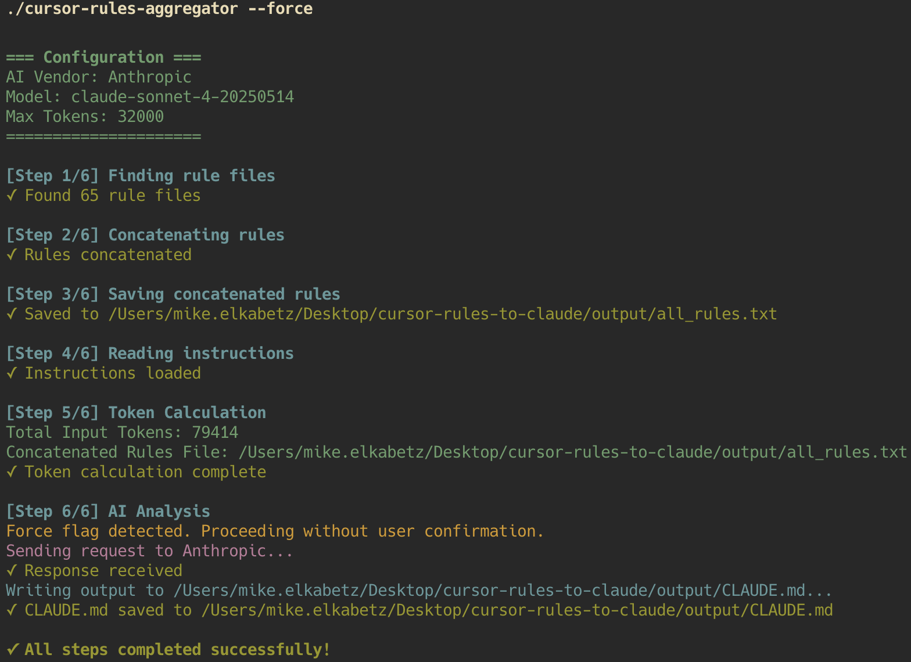

# Cursor Rules to Claude 🚀

> Easily aggregate your Cursor rules and generate a `CLAUDE.md` file for:
> - 🔄 Transition from Cursor to **Claude Code**
> - 🤖 Automated **CC Code Reviews** via [GitHub Action](https://github.com/anthropics/claude-code-action)

 
[](https://www.typescriptlang.org/)
[](https://www.anthropic.com/)
[](https://openai.com/)
[](https://opensource.org/licenses/MIT)
## 📖 Motivation

Moving between AI coding assistants shouldn't be a hassle. **Cursor Rules to Claude** empowers developers to:
1.  **Transition from Cursor to Claude Code:** Take your carefully crafted `.mdc` and Cursor rules with you.
2.  **Generate `CLAUDE.md`:** Create the configuration file required for [Claude Code Action](https://github.com/anthropics/claude-code-action) and CC Code Reviews automatically.
3.  **Consolidate Knowledge:** Aggregate scattered rule files into a single, cohesive context file (`all_rules.txt`) for any LLM.

## ✨ Features

-   **Automatic Aggregation:** Scans your `rules/` directory and combines all rule files.
-   **Smart Generation:** Uses Anthropic (Claude) or OpenAI (GPT) to intelligently synthesize a `CLAUDE.md` file based on your `system_prompt.txt`.
-   **Token Counting:** Calculates token usage before sending requests to avoid surprises.
-   **Dual Vendor Support:** Works with both Anthropic and OpenAI API keys.
-   **Executable Generation:** Build a standalone binary for easy usage across your system.

## 🛠️ Prerequisites

-   **Node.js** (v18+ recommended)
-   **pnpm** (or npm/yarn)
-   **API Key**: An `ANTHROPIC_API_KEY` or `OPENAI_API_KEY`.

## 🚀 Installation & Setup

1.  **Clone the repository:**
    ```bash
    git clone <your-repo-url>
    cd cursor-rules-to-claude
    ```

2.  **Install dependencies:**
    ```bash
    pnpm install
    ```

3.  **Configure Environment:**
    Create a `.env` file in the root directory:
    ```env
    # Required: Choose one (Anthropic is preferred for CLAUDE.md generation)
    ANTHROPIC_API_KEY=sk-ant-...
    # OR
    OPENAI_API_KEY=sk-proj-...

    # Optional Configuration
    MAX_TOKENS=32000
    
    # Optional: Override default models
    # ANTHROPIC_MODEL=claude-sonnet-4-20250514
    # OPENAI_MODEL=gpt-5.1-2025-11-13
    ```

## 💻 Development Workflow

To work on the tool and test changes locally:

1.  **Add Rules:** Place your Cursor rule files (e.g., `.mdc`, `.md`) in the `rules/` directory.
2.  **Run in Dev Mode:**
    ```bash
    pnpm start
    ```
    This runs `ts-node src/index.ts`.

3.  **Review Output:**
    -   `output/all_rules.txt`: The concatenated raw text of all your rules.
    -   `output/CLAUDE.md`: The generated instructions file.

## 📦 Creating the Executable

To build a standalone executable script that you can run from anywhere:

1.  **Build the project:**
    ```bash
    pnpm run build
    ```
    This compiles the TypeScript code and runs the executable creation script.

2.  **Locate the executable:**
    The executable will be created at `dist/cursor-rules-aggregator`.

3.  **Run the executable:**
    ```bash
    ./dist/cursor-rules-aggregator
    ```

    

    **Options:**
    -   `--force`: Skip the user confirmation prompt before sending the request to the AI provider.
        ```bash
        ./dist/cursor-rules-aggregator --force
        ```
        

## 🏗️ Project Structure

```
cursor-rules-to-claude/
├── rules/               # 📥 INPUT: Place your cursor rules here
├── output/              # 📤 OUTPUT: Generated files appear here
├── src/
│   ├── controllers/     # Main logic and flow
│   ├── services/        # AI integration (Anthropic/OpenAI)
│   └── utils/           # File handling helpers
├── scripts/             # Build scripts
├── system_prompt.txt    # Instructions for the AI on how to format CLAUDE.md
└── package.json
```

## 🤝 Contributing

 

1. Fork the repository
2. Create your feature branch (`git checkout -b feature/amazing-feature`)
3. Commit your changes (`git commit -m 'Add amazing feature'`)
4. Push to the branch (`git push origin feature/amazing-feature`)
5. Open a Pull Request

## 📄 License

[](LICENSE)

This project is licensed under the MIT License - see the [LICENSE](LICENSE) file for details.


